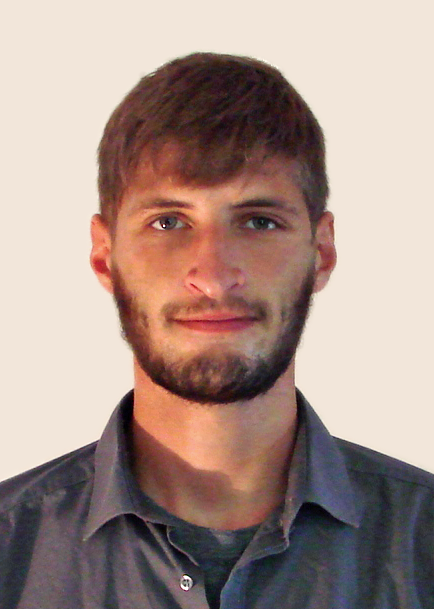

# Simon Leischnig
Autonomous Systems Master student

Post: Alexandraweg 38, 64287 Darmstadt  
Tel. 01590 / 5077 303 
<a href="mailto:simonjena@gmail.com">simon.leischnig@stud.tu-darmstadt.de</a>
 
<i class="fa fa-github"></i> <a href="http://github.com/simlei">"simlei" is my github account</a>,
<a href="http://github.com/simlei">http://simlei.github.io/hi is my public website</a>

## Education

`2016-`
__Technische Universität Darmstadt__ MSc Autonomous Systems, Informatics

`2015-16`
__Universidad Politécnica de Valencia__ School of Informatics

`2013-15`
__Technische Universität Darmstadt__ MSc Autonomous Systems, Informatics |
1-year lab project in 2014/15 under Prof. Peters and Dr. Kroemer

`2009-13`
__Technische Universität Darmstadt__ BSc Informatics  
Thesis: Adaptris-Tetris with dynamic difficulty as implementation of the ISA algorithm

`2008`
__Carl-Zeiss-Gymnasium Jena__ Highschool

## Work experience

`2014, 17` __TU Darmstadt__
Research assistant:
 2017 (current) Project organisation and management under Dr. Eichberg
 2014: Recommender systems lab under Prof. Brefeld

`2009-15`
__Cynops GmbH__ Software developer, Cryptography and Security

`2013-14`
__Lufthansa__ Freelance work, mobile applications

`2007-08`
__Eset Germany, Deutsche Bank__ Internships (two months each)

## Publications

`2017`
Kroemer, O.; __Leischnig, S.__; Luettgen, S.; Peters, J.; A Kernel-based Approach to Learning
Contact Distributions for Robot Manipulation Tasks, Autonomous Robots (AuRo)
(current, accepted)

`2015`
__Leischnig, S.__; Luettgen, S.; Kroemer, O.; Peters, J.; A Comparison of Contact Distribution
Representations for Learning to Predict Object Interactions, IEEE-RAS International
Conference on Humanoid Robots (Humanoids)

## Technical skills

* Java, Scala, scalaz
* Python
* C++
* GUI: Java SWT, JavaFX
* OSGi, Eclipse RCP
* Statistik und Machine learning
* Computer vision
* Git
* UNIX
* Ammonite Shell scripting
* LaTeX
* Markdown, HTML and CSS
* Javascript, Typescript

## Select Projects

### JCrypTool

I have contributed regularly to the [JCrypTool](https://github.com/jcryptool) open source project since I graduated from Highschool. I take care of GUI and core programming, project management and documentation. It is a huge Eclipse Rich Client Platform project with over 100 plug-ins that provide cryptography functionality and visualizations, and I am proud to be a part of it.

My current project there is to integrate the [Bouncy Castle crypto provider library](https://www.bouncycastle.org/) into this Java based project. The core of it is built with Scala and uses a Domain Specific Language to provide generic GUI and console functionality that is configurable and extensible via OSGi. The long-term plan is to base more and more of the core implementation on the purely functional [Scalaz](https://github.com/scalaz/scalaz) library and ultimatively make the DSL use [Free Applicatives](https://en.wikipedia.org/wiki/Applicative_programming_language) (from category theory) to base it on firm theoretical ground.

<!-- [JCrypTool at github](https://github.com/jcryptool) -- [JCrypTool homepage](https://www.cryptool.org/de/jcryptool) -->

### USB guitar
I chose to follow up on a long-hedged passion during a Virtual and Augmented Reality class: to connect music and computing. Using an [Arduino](https://www.arduino.cc/), we modified an old Western guitar such that it can be plugged into a computer via USB. The fingering position of the fretboard can then be inferred on the computer in real-time (with limitations).

As a proof-of-concept, we implemented a basic guitar teacher application. The position of the guitar is determined from a webcam feed with marker-based computer vision methods. Together with the fingering information from the USB guitar, it viualizes chords and scale information directly on the guitar fretboard in the video feed. This app utilizes [OpenCV](http://opencv.org/) marker tracking and OpenGL through integration with [Openframeworks](http://openframeworks.cc/).

<!-- [Check out the project log on github](http://simlei.github.io/VAR2017Project)! -->

## Languages

German (native)

English (fluent, C1/C2)

Spanish (advanced, B2)

<!-- ### Footer

Last updated: August 2017 -->
